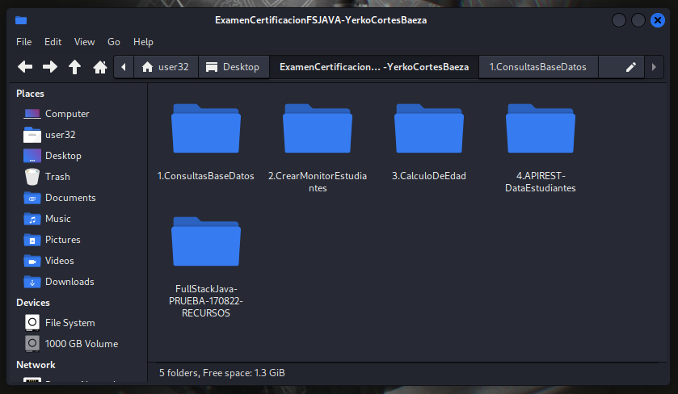

# Examen Certificación FullStack JAVA Trainee

> **Plan de estudio:** Desarrollo de aplicaciones FullStack Java Trainee.
**Anexo:** Caso Bootcamp Estudiantes Curso.
**Estudiante:** Yerko Andrés Cortés Baeza
**Fecha entrega:** 18 de Agosto del 2022
> 

> *Este entregable se encuentra respaldado en [Github](https://github.com/yerkodigo/ExamenCertificacionFSJAVA180822-Seccion0003) en caso de cualquier imprevisto. La modificación de los proyectos tendrá como última fecha el día de entrega, a excepción de este [README.md](http://readme.md/)*
> 

---

## Especificaciones entrega

Dentro de la entrega se encuentran cuatro carpetas de los puntos solicitados en el examen de certificación. En ellas se localizan los proyectos a importar en algún IDE de desarrollo para hacer ejecución.

---

## Probando proyectos.

> **NOTA:** *El desarrollo de los proyectos fue realizado en MySQL. Dentro de la carpeta **“1.ConsultaBaseDatos”** se encuentra un script SQL llamado “**scriptMODIFICADOBootcampMySQL.sql”** en donde se modificaron los nombres de las tablas debido a que MySQL es sensible a mayúsculas y minúsculas, dando errores al intentar importar la base de datos.*
> 

### 1. Consulta a la base de datos

> Dentro de la carpeta **“1.ConsultasBaseDatos”** se encuentra un script **“consultas.mysql”** con el desarrollo de las consultas y un **PDF** con los ejemplos de las mismas, siendo ejecutadas en una terminal de MySQL en Linux
> 

---

### 2. Monitor De estudiantes

> Para poder desplegar el monitor de estudiantes deberá indicar la ruta con path **“/estudiantes”**. En el caso de que llame la ruta raíz también será redirigido a la ruta mencionada.
> 

---

### 3. Algoritmo de cálculo de años de un estudiante

> Para probar este punto se deberá ejecutar la clase App.java que se encuentra dentro del paquete main como **Run Java Application**. Luego por consola se solicitara que ingrese las fechas de nacimiento de algunos estudiantes y automáticamente retornara la edad actual de estos.
***Para que todo funcione correctamente el formato de fecha deberá ser DD/MM/AAA ya la validacion esta en etapa de desarrollo.***
> 

---

### 4. API REST Monitor Estudiantes

> Para poder desplegar toda la información de los estudiantes deberá realizar una petición **GET** a la ruta **“/api/v1/estudiantes”** de su servidor.
> 

> Para poder obtener a los estudiantes filtrando por ID de Región y Código del Curso (codigo_plan_formativo). Se deberá usar Query Params en la ruta **“/api/v1/estudiantesFilter?region=1&curso=A5”** para la obtención de datos mediante el método get.
> 

---
